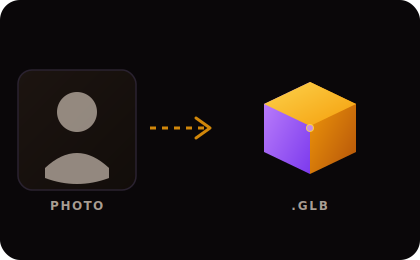

<p align="center">
  
</p>

# GLB_FACTORY

<p align="center">
  <a href="README.md"></a>
  <a href="README.es.md"></a>
  <a href="README.fr.md"></a>
  <a href="README.de.md"></a>
  <a href="README.pt-BR.md"></a>
  <a href="README.zh-CN.md"></a>
  <a href="README.ja.md"></a>
  <a href="README.ko.md"></a>
  <a href="README.it.md"></a>
  <a href="README.ar.md"></a>
</p>

<p align="center">
  
</p>

<p align="center">
  <a href="https://dacameragirl.github.io/GLB_FACTORY/"></a>
  
  
  
  
</p>

**Ein interaktives 3D-Foto-zu-Avatar-Studio.** Lade ein Porträt hoch, lass die App Gesicht,
Hautton, Haar- und Kleidungsfarbe erkennen und exportiere ein voll einsatzbereites
**GLB**-Modell für Spiele-Engines, ganz ohne 3D-Modellierungserfahrung.

Live-App: [dacameragirl.github.io/GLB_FACTORY](https://dacameragirl.github.io/GLB_FACTORY/)

---

## Wichtigste Funktionen

| Funktion | Was sie tut |
|---|---|
| **Foto → Avatar** | Ein einzelnes Porträt hochladen und einen spielfertigen 3D-Charakter erhalten |
| **Gesichtsbasierte Farberkennung** | Erkennt Hautton, Haar- und Kleidungsfarbe direkt aus dem Foto |
| **Frisurenempfehlung** | Schlägt einen passenden Frisurtyp basierend auf dem Quellbild vor |
| **Live-3D-Vorschau** | Den generierten Avatar vor dem Export in einer Three.js-Ansicht drehen und zoomen |
| **GLB-Export mit einem Klick** | Eine standardmäßige `.glb`-Datei für Spiele-Engines und 3D-Viewer herunterladen |
| **Funktioniert mit oder ohne Server** | Volle Gemini-Analyse bei Hosting, automatischer Canvas-Fallback bei statischem Betrieb |

## Zwei-Modi-Architektur

GLB_FACTORY läuft je nach Deployment-Umgebung auf zwei unterschiedliche Arten und wählt die
passende automatisch:

1. **KI-gestützter Modus (Node/Express-Hosting)** — In einer vollständigen Umgebung wie
   lokaler Entwicklung oder einem Cloud-Container spricht die App mit einem Backend-Proxy,
   der an **Gemini 3.5 Flash** angebunden ist. Gemini lokalisiert automatisch das Gesicht
   und liest Hautton, Haarfarbe, Kleidungsfarbe sowie eine empfohlene Frisur mit hoher
   visueller Genauigkeit aus.

2. **Statischer Fallback-Modus (GitHub Pages)** — Ohne verfügbares Backend erkennt die App
   die statische Umgebung und wechselt zur **clientseitigen Gesichtsanalyse**: Ein
   leichtgewichtiger HTML5-Canvas-Sampler liest die Pixel des Porträts direkt im Browser aus
   und extrahiert dieselben Farben, ganz ohne Netzwerkanfragen.

Gleiche Oberfläche, gleiches GLB-Ergebnis, zwei unterschiedliche Engines im Hintergrund, je
nachdem, was die Deployment-Umgebung tatsächlich ausführen kann.

---

## Schnellstart

```bash
npm install
npm run dev
```

Öffne [http://localhost:3000](http://localhost:3000) im Browser.

Für die KI-gestützte Analyse lokal einen Gemini-Schlüssel hinzufügen:

```env
# .env.local
GEMINI_API_KEY=your_gemini_api_key_here
```

Ohne Schlüssel läuft die App trotzdem, sie nutzt dann einfach den clientseitigen Fallback.

## Deployment auf GitHub Pages

Das Repository enthält `.github/workflows/deploy.yml`, das die statische App bei jedem
Push auf `main` baut und veröffentlicht.

1. Zum Repository auf GitHub gehen, dann **Settings**.
2. Unter **Code and automation → Pages** bei **Source** **GitHub Actions** auswählen.
3. Auf `main` pushen und den Build im Tab **Actions** verfolgen.

---

## Verwendete Technologien

| Ebene | Stack |
|---|---|
| 3D-Rendering | **Three.js** — WebGL-Rendering und prozedurale Avatar-Mesh-Erstellung |
| Frontend | **React 19** + **Vite 6** — SPA-Runtime und Build |
| Styling | **Tailwind CSS v4** |
| Icons | **Lucide React** |
| Backend | **Express** + **Google GenAI SDK** — Gemini-API-Proxy |

## Mitwirkende

- Angela — Produktrichtung, Tests
- Claude — Implementierung und GitHub-Workflow

## Rechtliches

Hochgeladene Fotos werden ausschließlich zur Erstellung eines 3D-Avatars verarbeitet. Im
KI-Modus werden Bilddaten gemäß den Bedingungen von Google an die Gemini-API gesendet; im
statischen Fallback-Modus läuft die Analyse vollständig im Browser, und nichts verlässt das
Gerät.
