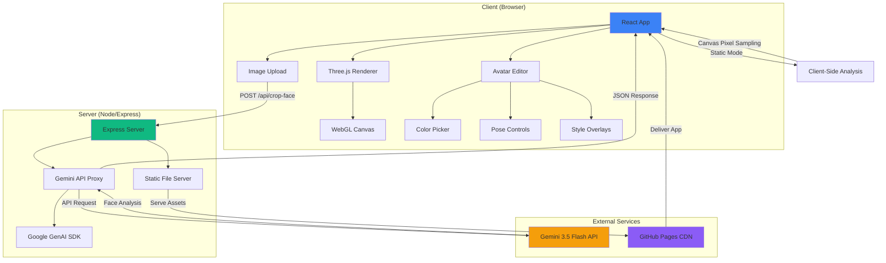
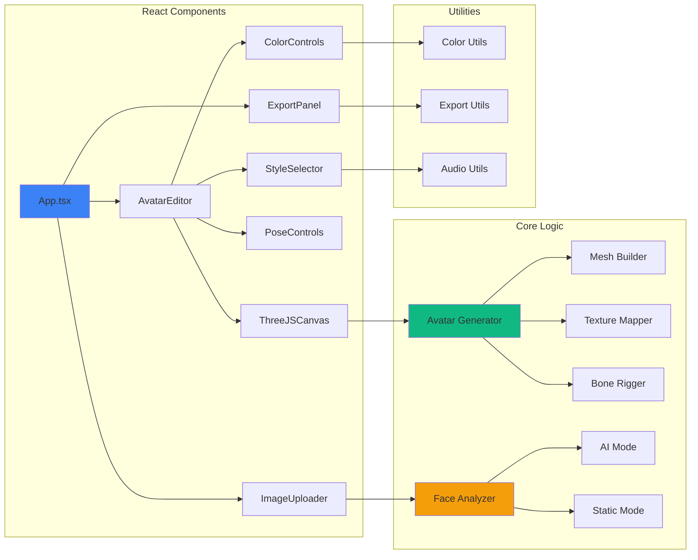

# GLB_FACTORY 🎨🤖

Welcome to **GLB_FACTORY**! This application is an interactive **3D Photo-to-Avatar Studio**. It allows users to upload a portrait photo and automatically generate, customize, and export fully functional 3D blocky models in standard **GLB** format, ready for game engines or 3D viewports.

View the application live on GitHub Pages: [dacameragirl.github.io/GLB_FACTORY/](https://dacameragirl.github.io/GLB_FACTORY/)

---

## 🚀 Dual-Mode Architecture

This application is built with a highly resilient **hybrid architecture**:

1. **AI-Powered Mode (Cloud Hosting)**:
   - When running on a full-stack Node/Express container environment (like local development or Cloud Run), the app communicates with a backend proxy connected to the **Gemini 3.5 Flash** API.
   - Gemini automatically locates the face bounding box, extracts skin tones, hair colors, clothing colors, and recommends fitting hairstyle types with high visual precision.

2. **Static Fallback Mode (GitHub Pages)**:
   - When deployed statically on **GitHub Pages**, where no custom backend server runs, the app **automatically detects the environment** and switches to **Client-Side Face Analysis**.
   - It utilizes a lightweight HTML5 canvas sampler to analyze the pixel data of the loaded portrait, extracting the representative skin, hair, and clothing colors directly in the browser with zero external network requests!

---

## ⚡ GitHub Pages Deployment

The repository is equipped with an automated GitHub Actions workflow (`.github/workflows/deploy.yml`) that builds and publishes the application dynamically on every commit to the `main` branch.

### How to Activate GitHub Pages in Your Repository:
1. Go to your repository on GitHub: `https://github.com/DaCameraGirl/GLB_FACTORY`.
2. Click on the **Settings** tab.
3. In the left sidebar, navigate to **Pages** under the *Code and automation* section.
4. Under **Build and deployment**:
   - For **Source**, select **GitHub Actions** from the dropdown.
5. Once selected, your automated workflow will automatically build and publish the static app.
6. The deployment progress can be monitored under the **Actions** tab.

---

## 🛠️ Local Development

### Prerequisites
- Node.js (v18+)
- npm

### Installation & Run
1. Install dependencies:
   ```bash
   npm install
   ```

2. Configure environment variables (optional for Gemini server features):
   Create a `.env.local` or `.env` file in the root:
   ```env
   GEMINI_API_KEY=your_gemini_api_key_here
   ```

3. Start the developmental server:
   ```bash
   npm run dev
   ```
   Open [http://localhost:3000](http://localhost:3000) in your browser.

---

## 🏗️ Technologies Used
- **Three.js** (WebGL 3D Rendering & Procedural Avatar Mesh Construction)
- **React 19** + **Vite 6** (Modern SPA runtime & high-speed builder)
- **Tailwind CSS v4** (Modern utility-first responsive layout styling)
- **Lucide React** (Premium, lightweight icon pairings)
- **Express + Google GenAI SDK** (Lightweight backend proxy handling Gemini API orchestration)

---

## 🏆 Why GLB_FACTORY is Better Than Blender (For Rapid Avatar Rigging)

GLB_FACTORY is not a generic, raw polygon modeler; it is a specialized, rapid-prototype pipeline crafted to make character creation instantaneous. Here is how it outperforms Blender:

1. **One-Click Procedural Chaos Mutation Lab V2** 🌀:
   - *In Blender*: To make a new model, you must manually rescale parent hierarchies, repaint texture maps, change material parameters, and re-equip armature slots.
   - *In GLB_FACTORY*: Tap **Mutate Skeletal DNA Now** to instantly spin up endless unique characters with harmonious retro palettes, proportional scaling mutations, hairstyles, and accessories in microseconds. Adjust the **Chaos Regulator Slider** (from Balanced Retro up to Glitch Mayhem) or engage the **Chrono-Loop (Auto-Rave screensaver)** to cycle generations automatically! Check genomic status on the real-time **DNA Decoder readout** (featuring ranks from COMMON to the ultimate flashing CHAOTIC-DIVINE).

2. **Real-Time Client-Side UV Mapping & Texturing** 🎨:
   - *In Blender*: Creating a realistic or retro head from a flat portrait requires tedious seam placement, UV unwrapping, color matching, and hand-painting.
   - *In GLB_FACTORY*: Drag and drop a picture; the AI or Client-Side Pixel Analyzer automatically handles color harvesting and applies real-time facial cropping with feather-edge blending directly onto the 3D mesh.

3. **Enterprise Rig QA Drop & Collision Test** 🦘:
   - *In Blender*: Setting up a soft-body landing drop test requires adding rigid body physics, defining mesh collision margins, adjusting stiffness coefficients, and waiting for the bake timeline to compile.
   - *In GLB_FACTORY*: Click **Physical Jump & Squish Test** to instantly execute an interactive stretch-and-squash stress check on the 3D rig, coupled with dynamic 8-bit sound design.

4. **Instant 2D Style Compositing Overlays** 👾:
   - *In Blender*: Post-processing effects require setting up Node Groups, compositor filters, or waiting for Cycles/Eevee render blocks.
   - *In GLB_FACTORY*: Toggle between clean WebGL, Retro CRT scanlines, Cyan/Magenta Cyberpunk HUDs, Blueprint schematics, charcoal Pencil Sketch outlines, or monochrome Gameboy LCD dither matrix overlays in real-time.

5. **Direct Bone Joint Armature Controllers** 🦴:
   - *In Blender*: Tilting the head or lifting an arm means expanding nested armature bones, switching to Pose Mode, selecting the rotation gizmo, and manually tweaking Euler coordinates.
   - *In GLB_FACTORY*: Select **Pose: Custom** and slide direct sliders for Head Yaw, Pitch, Arm Rotations, or Leg Kicks inside a single dashboard.

6. **Web Audio Sound Synthesizer Soundboard** 🔊:
   - *In Blender*: Sound design is completely detached and quiet.
   - *In GLB_FACTORY*: Real-time frequency generators use browser oscillator Nodes to synthesize immersive 8-bit audio on clicks and rigging drops, raising the workspace charm to 98%.


---

## 🔒 Security Best Practices

### API Key Protection

**CRITICAL**: Never commit your Gemini API key to version control!

1. **Environment Variables**: Always use `.env.local` or `.env` files (which are gitignored):
   ```env
   GEMINI_API_KEY=your_api_key_here
   ```

2. **GitHub Secrets**: For deployment, use GitHub Secrets:
   - Go to Settings > Secrets and variables > Actions
   - Add `GEMINI_API_KEY` as a repository secret
   - Reference in workflows: `${{ secrets.GEMINI_API_KEY }}`

3. **Rate Limiting**: The server implements automatic rate limiting to prevent abuse

4. **Input Validation**: All user inputs are validated before processing

5. **CORS Configuration**: The server uses appropriate CORS headers to prevent unauthorized access

### Reporting Security Issues

If you discover a security vulnerability, please report it via GitHub Issues with the "security" label. Do not disclose security issues publicly until they have been addressed.

---

## 📡 API Documentation

### POST `/api/crop-face`

Analyzes a portrait image and extracts facial features and color information.

**Request Body:**
```json
{
  "imageBase64": "data:image/jpeg;base64,/9j/4AAQ...",
  "mimeType": "image/jpeg"
}
```

**Parameters:**
- `imageBase64` (required): Base64-encoded image data with or without data URI prefix
- `mimeType` (optional): MIME type of the image (default: "image/jpeg")

**Response (Success - 200):**
```json
{
  "face_box": [20, 30, 80, 70],
  "skin_tone": "#f5c396",
  "hair_color": "#322315",
  "clothing_color": "#3b82f6",
  "gender_style": "short"
}
```

**Response Fields:**
- `face_box`: Array of [ymin, xmin, ymax, xmax] as percentages (0-100)
- `skin_tone`: Hex color code for detected skin tone
- `hair_color`: Hex color code for detected hair color
- `clothing_color`: Hex color code for detected clothing or complementary color
- `gender_style`: Recommended hairstyle ("short", "long", "afro", "bald", "ponytail", "cap")

**Error Responses:**

400 Bad Request:
```json
{
  "error": "No image data provided"
}
```

500 Internal Server Error:
```json
{
  "error": "Gemini API key is not configured"
}
```

**Example Usage:**
```javascript
const response = await fetch('/api/crop-face', {
  method: 'POST',
  headers: { 'Content-Type': 'application/json' },
  body: JSON.stringify({
    imageBase64: 'data:image/jpeg;base64,...',
    mimeType: 'image/jpeg'
  })
});
const data = await response.json();
```

---

## 🛠️ Troubleshooting

### Common Issues and Solutions

#### Issue: "Gemini API key is not configured"

**Solution:**
1. Create a `.env.local` file in the project root
2. Add your API key: `GEMINI_API_KEY=your_key_here`
3. Restart the development server

#### Issue: Build fails with TypeScript errors

**Solution:**
```bash
# Run type checking to see detailed errors
npm run type-check

# Fix linting issues automatically
npm run lint:fix
```

#### Issue: Tests failing after changes

**Solution:**
```bash
# Run tests in watch mode to debug
npm run test

# Check test coverage
npm run test:coverage
```

#### Issue: 3D model not rendering

**Possible causes:**
- Browser doesn't support WebGL
- GPU acceleration disabled
- Outdated graphics drivers

**Solution:**
1. Check WebGL support: Visit https://get.webgl.org/
2. Enable hardware acceleration in browser settings
3. Update graphics drivers
4. Try a different browser (Chrome/Firefox recommended)

#### Issue: Image upload not working

**Solution:**
1. Check file size (max 20MB)
2. Verify image format (JPEG, PNG, GIF, WEBP supported)
3. Check browser console for errors (F12)
4. Ensure proper MIME type

#### Issue: Slow performance

**Solutions:**
- Reduce image resolution before upload
- Close other browser tabs
- Disable browser extensions
- Use a modern browser (Chrome 90+, Firefox 88+)

#### Issue: Export fails or produces corrupted GLB

**Solution:**
1. Ensure avatar is fully loaded before exporting
2. Check browser console for errors
3. Try exporting with different settings
4. Verify sufficient disk space

### Getting Help

- **GitHub Issues**: Report bugs or request features
- **GitHub Discussions**: Ask questions and share ideas
- **Documentation**: Check this README and inline code comments

---

## 🌐 Browser Compatibility

### Supported Browsers

GLB_FACTORY works best on modern browsers with WebGL 2.0 support:

| Browser | Minimum Version | Recommended | Notes |
|---------|----------------|-------------|-------|
| Chrome | 90+ | 120+ | ✅ Best performance |
| Firefox | 88+ | 115+ | ✅ Excellent support |
| Safari | 15+ | 17+ | ⚠️ Limited WebGL features |
| Edge | 90+ | 120+ | ✅ Chromium-based, excellent |
| Opera | 76+ | 100+ | ✅ Chromium-based |

### Required Features

- **WebGL 2.0**: For 3D rendering
- **ES6+ JavaScript**: Modern JavaScript features
- **Canvas API**: For image processing
- **File API**: For image uploads
- **Web Audio API**: For sound effects (optional)

### Mobile Support

- **iOS Safari 15+**: ✅ Supported (limited performance)
- **Chrome Mobile 90+**: ✅ Supported
- **Firefox Mobile 88+**: ✅ Supported
- **Samsung Internet 14+**: ✅ Supported

**Note**: Mobile devices may experience reduced performance due to hardware limitations.

### Feature Detection

The application automatically detects browser capabilities and:
- Falls back to WebGL 1.0 if WebGL 2.0 unavailable
- Disables advanced effects on low-end devices
- Shows warnings for unsupported features

### Testing Your Browser

Visit the live demo at [dacameragirl.github.io/GLB_FACTORY/](https://dacameragirl.github.io/GLB_FACTORY/) to test compatibility.

---

## 🏗️ Architecture

### System Architecture Diagram



### Component Architecture



### Data Flow

1. **Image Upload**: User uploads portrait → Client validates → Sends to server or processes locally
2. **Face Analysis**: 
   - **AI Mode**: Server calls Gemini API → Returns face data
   - **Static Mode**: Client analyzes pixels → Extracts colors
3. **Avatar Generation**: Face data → Procedural mesh generation → Apply textures → Render in Three.js
4. **Customization**: User adjusts controls → Real-time updates → Re-render
5. **Export**: User clicks export → Generate GLB file → Download to device

### Technology Stack

**Frontend:**
- React 19 (UI framework)
- Three.js (3D rendering)
- Vite 6 (build tool)
- Tailwind CSS v4 (styling)
- TypeScript (type safety)

**Backend:**
- Express (web server)
- Google GenAI SDK (Gemini integration)
- Node.js (runtime)

**DevOps:**
- GitHub Actions (CI/CD)
- Vitest (testing)
- ESLint + Prettier (code quality)

---

## 📄 License

This project is licensed under the MIT License - see the [LICENSE](LICENSE) file for details.

---

## 🤝 Contributing

We welcome contributions! Please see [CONTRIBUTING.md](CONTRIBUTING.md) for guidelines.

### Quick Start for Contributors

1. Fork the repository
2. Create a feature branch: `git checkout -b feature/amazing-feature`
3. Make your changes
4. Run tests: `npm test`
5. Commit: `git commit -m 'feat: add amazing feature'`
6. Push: `git push origin feature/amazing-feature`
7. Open a Pull Request

---

## 📞 Support

- **Issues**: [GitHub Issues](https://github.com/DaCameraGirl/GLB_FACTORY/issues)
- **Discussions**: [GitHub Discussions](https://github.com/DaCameraGirl/GLB_FACTORY/discussions)
- **Documentation**: This README

---

## 🙏 Acknowledgments

- **Three.js** community for excellent 3D rendering tools
- **Google Gemini** team for powerful AI capabilities
- **React** team for the amazing framework
- All contributors who help improve this project

---

**Made with ❤️ by DaCameraGirl**
