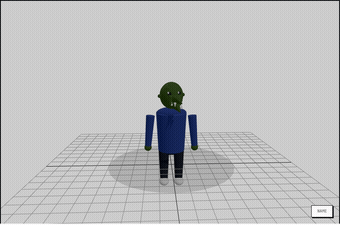
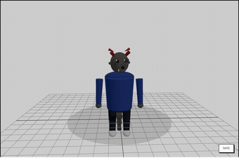
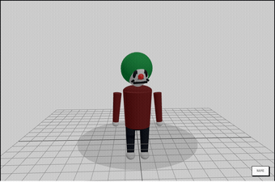
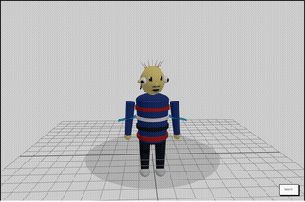

<p align="center">
  
</p>

<p align="center">
  <a href="https://dacameragirl.github.io/GLB_FACTORY/"></a>
  
  
  
  
</p>

Upload a portrait — or spin up the Mutation Lab — and export a customizable, poseable **`.glb`** with PBR materials and an organized mesh hierarchy. Blocky, organic, or a full-on creature. GLB_FACTORY is a browser-based procedural avatar studio built from primitive 3D shapes (cylinders, boxes, spheres) in the spirit of Minecraft/Roblox-style voxel characters — no Blender, no manual UV unwrapping, no waiting for a bake.

**Two connected modes**

1. **Create From Photo** — Upload portrait → build avatar → customize → export GLB  
2. **Mutation Lab** — Generate specimens → collect rare mutations → breed two parents → export offspring

> **Export honesty:** Viewport walk/dance/pose controls animate mesh groups in the browser. The GLB exporter currently ships an empty animation list. Treat downloads as poseable hierarchies with materials — not Mixamo-ready skinned AnimationClip characters — until full bones + clips land.

### 🎭 Live from the Mesh Style dropdown — actual in-app renders, not concept art

<table align="center">
<tr>
<td align="center"><br/><b>🐊 Alligator</b><br/><sub>animated chomping jaw</sub></td>
<td align="center"><br/><b>👹 Monster</b><br/><sub>warts &amp; fangs</sub></td>
<td align="center"><br/><b>🤡 Evil Clown</b><br/><sub>because someone asked</sub></td>
<td align="center"><br/><b>🦁🐟 Lionfish</b><br/><sub>venomous spike rays</sub></td>
</tr>
</table>

---

## 🚀 Dual-Mode Architecture

1. **AI-Powered Mode** — When a backend is available (local dev, or a self-hosted deployment with your own `GEMINI_API_KEY`), the app calls the Gemini API to locate the face and extract skin/hair/clothing colors automatically. **This is not active on the live GitHub Pages demo above** — GitHub Pages serves static files only, there's no backend to call.
2. **Static Fallback Mode (what the live demo actually runs)** — An HTML5 canvas sampler reads the portrait pixel data directly in-browser and estimates the same colors client-side. Zero network requests, zero API key required.

---

## 🧬 What you can build

| Category | Options |
|---|---|
| **Base mesh style** | Organic Humanoid, Rounded Cube (voxel), Classic Box (retro blocky) |
| **Creature mesh styles** | 🧌 Gremlin, 👹 Monster, 🐊 Alligator, 🦝 Raccoon, 🐱 Cat, 🐶 Dog, 🦎 Lizard, 🐀 Possum, 🐠 Tiger Fish, 🦁🐟 Lionfish, 🤡 Evil Clown — each with its own head geometry (jaws, masks, fins, spikes, floppy ears — not just a recolor) |
| **Individual creature parts** | Fins 🐟, Tail 🦎, Snout 🐽, Whiskers 🐱, Mushroom Cap 🍄 (mix onto any base mesh style) |
| **Gear** | Blaster 🔫, Knife 🗡️, Herb Pouch 🌿, plus Glasses, Wings, Horns, Crown, Halo, Cyber Visor, Cape |
| **Poses (in-viewer)** | Idle, Walk, Dance, Zombie, Spin, Ninja, or joint sliders — live mesh-group posing in the studio (not exported as AnimationClips yet) |
| **Snap Studio** | 3D particle lenses, big-head lens, VHS/Cyber/Sepia/Glitch color filters, custom caption overlay |
| **Mutation Lab** | One click generates a new proportional/palette variant, ranked from `COMMON` up to the elusive `CHAOTIC-DIVINE` |

More species (turtle, snake) and a moving-tentacle octopus variant are actively in progress.

---

## ⚡ GitHub Pages Deployment

An automated GitHub Actions workflow (`.github/workflows/deploy.yml`) builds and publishes the app on every push to `main`.

To activate it on a fork: **Settings → Pages → Build and deployment → Source: GitHub Actions.** Progress shows under the **Actions** tab.

---

## 🛠️ Local Development

**Prerequisites:** Node.js 18+, npm

```bash
npm install
npm run dev
```

Open [http://localhost:3000](http://localhost:3000).

Optional, to enable Gemini-powered face detection locally instead of the client-side fallback — create `.env.local`:

```env
GEMINI_API_KEY=your_gemini_api_key_here
```

---

## 🏗️ Technologies Used

- **Three.js** — WebGL rendering & procedural mesh construction
- **React 19 + Vite 6** — SPA runtime & build
- **Tailwind CSS v4** — utility-first styling
- **Lucide React** — icons
- **Express + Google GenAI SDK** — optional backend proxy for Gemini orchestration (self-hosted only, not used by the GitHub Pages demo)

---

## 🏆 Highlights

1. **One-Click Procedural Chaos Mutation Lab** 🌀 — Tap **Mutate Skeletal DNA Now** for instant palette/proportion variants instead of manually rescaling hierarchies and repainting textures by hand. Tune the Chaos Regulator, or let the Chrono-Loop auto-cycle generations. Genomic rank flashes from `COMMON` to `CHAOTIC-DIVINE`.
2. **Live Client-Side Texture Blending** 🎨 — Drag a photo in; color harvesting and feather-edge facial blending onto the head texture happen live in-browser. (The UV coordinates themselves are a fixed projection computed at mesh-build time — what's live is the texture painted onto them, not the mapping itself.)
3. **Rig QA Drop & Squish Test** 🦘 — One click runs a stretch-and-squash stress check on the live rig, with 8-bit sound design.
4. **Instant 2D Style Overlays** 👾 — Retro CRT, Cyberpunk HUD, Blueprint, Pencil Sketch, or Gameboy dither, toggled live.
5. **Direct Bone Joint Controllers** 🦴 — Slide Head Yaw/Pitch, arm rotation, or leg kicks directly.
6. **Web Audio Soundboard** 🔊 — Real oscillator-driven 8-bit sound on rig actions, shutter clicks, and meltdowns.

---

<p align="center">
  <sub>Built by <a href="https://github.com/DaCameraGirl">DaCameraGirl</a> — bug reports and creature requests welcome.</sub>
</p>
