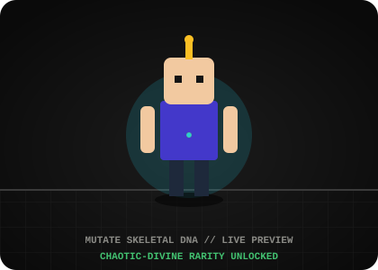

<p align="center">
  
</p>

<p align="center">
  <a href="https://dacameragirl.github.io/GLB_FACTORY/"></a>
  
  
  
  
</p>

<p align="center">
  
</p>

Upload a portrait. Get back a rigged, textured, exportable **`.glb`** — blocky, organic, or somewhere delightfully in between. GLB_FACTORY is a browser-based procedural avatar studio: no Blender, no manual UV unwrapping, no waiting for a bake.

---

## 🚀 Dual-Mode Architecture

1. **AI-Powered Mode (Cloud Hosting)** — When running on a full Node/Express container (local dev, Cloud Run), the app talks to a backend proxy wired to **Gemini 3.5 Flash**, which locates the face bounding box and extracts skin, hair, and clothing colors automatically.
2. **Static Fallback Mode (GitHub Pages)** — With no backend available, the app detects this and switches to **client-side face analysis**: an HTML5 canvas sampler reads the portrait pixel data directly in-browser, zero network requests.

---

## 🧬 What you can build

| Category | Options |
|---|---|
| **Mesh style** | Organic Humanoid, Rounded Cube (voxel), Classic Box (retro blocky) |
| **Creature parts** | Fins 🐟, Tail 🦎, Snout 🐽, Whiskers 🐱, Mushroom Cap 🍄 |
| **Gear** | Blaster 🔫, Knife 🗡️, Herb Pouch 🌿, plus Glasses, Wings, Horns, Crown, Halo, Cyber Visor, Cape |
| **Poses & rig** | Idle, Walk, Dance, Zombie, Spin, Ninja, or fully custom bone-by-bone armature control |
| **Snap Studio** | 3D particle lenses, big-head lens, VHS/Cyber/Sepia/Glitch color filters, custom caption overlay |
| **Mutation Lab** | One click generates a new proportional/palette variant, ranked from `COMMON` up to the elusive `CHAOTIC-DIVINE` |

More creature parts (raccoon, gator, tiger-fish, turtle-flavored preset bundles) are in the pipeline.

---

## ⚡ GitHub Pages Deployment

An automated GitHub Actions workflow (`.github/workflows/deploy.yml`) builds and publishes the app on every push to `main`.

To activate it on a fork: **Settings → Pages → Build and deployment → Source: GitHub Actions.** Progress shows under the **Actions** tab.

---

## 🛠️ Local Development

**Prerequisites:** Node.js 18+, npm

```bash
npm install
npm run dev
```

Open [http://localhost:3000](http://localhost:3000).

Optional, for Gemini-powered face detection instead of the client-side fallback — create `.env.local`:

```env
GEMINI_API_KEY=your_gemini_api_key_here
```

---

## 🏗️ Technologies Used

- **Three.js** — WebGL rendering & procedural mesh construction
- **React 19 + Vite 6** — SPA runtime & build
- **Tailwind CSS v4** — utility-first styling
- **Lucide React** — icons
- **Express + Google GenAI SDK** — backend proxy for Gemini orchestration

---

## 🏆 Why GLB_FACTORY beats Blender for rapid avatar rigging

1. **One-Click Procedural Chaos Mutation Lab** 🌀 — Tap **Mutate Skeletal DNA Now** for instant palette/proportion variants instead of manually rescaling hierarchies and repainting textures. Tune the Chaos Regulator, or let the Chrono-Loop auto-cycle generations. Genomic rank flashes from `COMMON` to `CHAOTIC-DIVINE`.
2. **Real-Time Client-Side UV Mapping** 🎨 — Drag a photo in; color harvesting and feather-edge facial blending happen live, no manual seam placement or hand-painting.
3. **Enterprise Rig QA Drop & Squish Test** 🦘 — One click runs a stretch-and-squash collision stress check with 8-bit sound design, instead of hand-configuring rigid body physics.
4. **Instant 2D Style Overlays** 👾 — Retro CRT, Cyberpunk HUD, Blueprint, Pencil Sketch, or Gameboy dither, toggled live instead of built through compositor node graphs.
5. **Direct Bone Joint Controllers** 🦴 — Slide Head Yaw/Pitch, arm rotation, or leg kicks directly, no Pose Mode gizmo hunting.
6. **Web Audio Soundboard** 🔊 — Real oscillator-driven 8-bit sound on rig actions. Blender ships silent.

---

<p align="center">
  <sub>Built by <a href="https://github.com/DaCameraGirl">DaCameraGirl</a> — bug reports and creature requests welcome.</sub>
</p>
